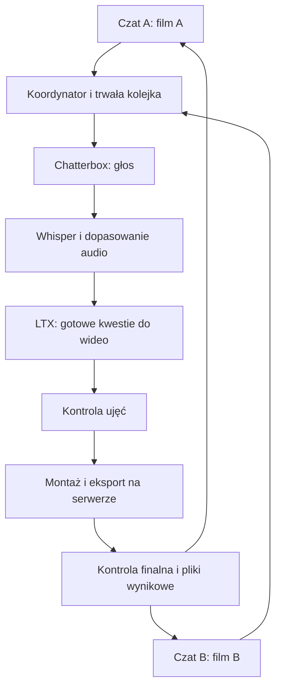

# Równoległa produkcja filmów na wspólnym serwerze

Status: propozycja do uzgodnienia z Adrianem; wymagania zatwierdzone, rozwiązanie techniczne wymaga dopasowania do jego bieżącej pracy. Kod i działający serwer pozostają bez zmian.
Punkt odniesienia review kodu: `53476bdc54f161f0f525df9a38dd380024a04fe5` na `main`.
Data: 2026-10-02.

## Problem Statement

Kilka czatów ma niezależnie prowadzić różne filmy, korzystając z jednego serwera. Komputer użytkownika nie musi wykonywać ciężkiego przetwarzania; wykonanie lokalne jest dopuszczone jako świadomie wybrana opcja. Celem jest nakładanie pracy etapów i ograniczenie przeładowywania modeli, przy zachowaniu jakości oraz niezależności produkcji.

### Uzgodnione wymagania

| ID | Wymaganie |
| --- | --- |
| R1 | Jeden czat prowadzi jeden film; co najmniej dwa czaty mogą równocześnie zlecać i odbierać pracę. |
| R2 | Domyślnie generowanie głosu i wideo, kontrola oraz dopasowanie audio, montaż i eksport odbywają się na serwerze. Użytkownik może opcjonalnie wybrać wykonanie wybranych etapów na swoim komputerze; słaby klient nadal obsługuje cały proces zdalnie. |
| R3 | GPU wykorzystujemy tylko tam, gdzie pomiary potwierdzają poprawę wydajności bez pogorszenia stabilności lub jakości; modele mogą pozostawać w pamięci. Nie wymuszamy akceleracji. |
| R4 | Etapy różnych ujęć i filmów mogą postępować równolegle z zachowaniem zależności i kontroli jakości. |
| R5 | Wspólna kolejka sprawiedliwie obsługuje filmy; zatrzymanie jednego nie przerywa drugiego ani nie wyłącza używanego serwera. |
| R6 | Praca przyjęta przez serwer trwa po rozłączeniu klienta; ponowne połączenie odzyskuje stan bez ślepego powtarzania generowania. |
| R7 | Rozwijamy kopię w yesopen-video, zachowując dotychczasowy tryb sekwencyjny oraz formaty produkcji. |

Założenia: zakres uzgodniony w rozmowie obejmuje wspólny koordynator, odrębne filmy, sprawiedliwą kolejkę i wszystkie ciężkie etapy na serwerze. Propozycje techniczne poniżej realizują te wymagania; nie stanowią zgody na uruchomienie płatnego benchmarku ani wdrożenie.

## Repozytorium i sposób pracy

Kanoniczne repo rozwoju silnika: `https://github.com/behavio1/yesopen-higgsfield-skits`.
Bazowa gałąź: `main`. Ścieżki kodu w dokumencie są względne do katalogu głównego tego repozytorium; lokalizacja checkoutu zależy od użytkownika.

Implementacja, testy, instrukcje skilla i ten design należą do tego repo. Zmiany rozwijamy na gałęzi zadania i przekazujemy przez GitHub; kopia w Localesto nie jest już miejscem rozwoju tej funkcji. `yesopen-gpu-stack` pozostaje historycznym repo, bez równoległej implementacji. Spełnia R7 oraz dodatkowe wymaganie użytkownika pracy na istniejącym repo GitHub.

Katalog nadrzędny `yesopen-video` jest obszarem roboczym: produkcje, prywatna konfiguracja i raport kopii nie są automatycznie publikowane. Przed każdym commitem sprawdzić dokładną listę plików; przed pushem remote, gałąź i skuteczną tożsamość Git. Design nie autoryzuje wdrożenia na działający serwer.

## Current State

Poniższe punkty opisują kod bazowego commitu, nie nieopublikowane zmiany Adriana.

| Miejsce | Stan odczytany w kodzie i konsekwencja |
| --- | --- |
| `gpu/client/gpu.py:cmd_batch` | Każde zadanie czeka na zakończenie poprzedniego. Jeden adres `comfy_url`. Pomijanie zadań opiera się na nazwie z `jobs.jsonl`. |
| `gpu/client/gpu.py:run_job` | Wysłanie grafu, oczekiwanie, pobranie wyników i zapis logu są połączone. Identyfikator ComfyUI trafia do trwałego logu dopiero po zakończeniu. |
| `gpu/client/gpu.py:Comfy.cancel` | Używa `/interrupt`; przed wykorzystaniem współdzielonym konieczna jest weryfikacja zakresu przerwania. |
| `gpu/server/compose.yaml` | Jeden proces ComfyUI; editor jest uruchamiany na żądanie i nie ma limitów CPU/RAM. |
| `scripts/gpu_batches.py:cmd_takes` | Obsługuje wybór pojedynczych kwestii przez `--only`; można przygotować ujęcie bez czekania na cały film. |
| `scripts/fit_lines.py:main` | Whisper ładuje się przy uruchomieniu; plik `fit.json` jest czytany i zapisywany jako całość. Równoległe procesy mogłyby zgubić wzajemne wyniki. |
| `gpu/editor/Dockerfile` | PyTorch jest CPU-only. Samo przeniesienie skryptu Whisper do tego kontenera nie zapewni pracy na GPU. |
| `scripts/assemble.py`, `inspect_take.py`, `qa_report.py` | Kilka niezależnych miejsc ładuje Whisper. Montaż koduje przez `libx264`. |
| `gpu/client/gpu.py:cmd_edit`, `cmd_push`, `cmd_pull` | Zdalny montaż już istnieje, ale używa nazwy katalogu jako identyfikatora oraz wspólnego `/srv/yesopen/skill`, nadpisywanego przy synchronizacji. Transfer wyklucza `edit/work`, lecz nie wyklucza `reference/private`. |
| `SKILL.md`, `gpu/client/gpu.py:cmd_stop` | Dotychczasowy cykl pojedynczej produkcji zakłada zakończenie sesji maszyny; nie nadaje się bez zmian do współdzielenia. |

Pomiar autora z 2026-10-02 (migawka, nie aktualny stan serwera): H200, 143771 MiB VRAM, 44 CPU, 167 GiB RAM; jeden wykonywany graf i jeden oczekujący. Krótkie próbki nie określają maksymalnej pamięci ani przepustowości. Pierwszy odczyt zajętości VRAM: 53439 MiB; osiem kolejnych próbek co 2 s: 28597–38805 MiB, wykorzystanie GPU 2–72%. Są to obserwacje orientacyjne bez dołączonego surowego śladu, nie podstawa do ustalenia limitów. Przed wdrożeniem należy ponownie sprawdzić target, zasoby i konfigurację. Dokument nie wymaga dostępu do lokalnych raportów autora.

## Proposed Changes

### Architecture

**Jeden koordynator na serwerze, kilku lekkich klientów oraz procesy wykonawcze wyspecjalizowane według etapu.** Rozdzielenie procesów umożliwia zachowanie modeli i nakładanie obliczeń; nie gwarantuje przyspieszenia na jednej karcie. [R1–R6]

Strzałki pokazują zależności jednej kwestii. Różne kwestie i filmy znajdują się równocześnie na różnych etapach. Koordynator prowadzi stan także kontroli, montażu i finalnego QA. Potwierdzenia twórcze i ocena wizualna nadal należą do czatu/użytkownika; techniczna kontrola nie zastępuje ich. [R2, R4]

### Podział zasobów

| Praca | Propozycja wykonania | Powiązanie |
| --- | --- | --- |
| Głos | Osobny proces ComfyUI z Chatterbox, jeden aktywny graf głosowy. | R2–R4 |
| Wideo | Osobny proces ComfyUI z LTX, jeden aktywny graf wideo. | R2–R4 |
| Transkrypcja i kontrola słów | Wspólny proces Whisper, model ładowany raz; jawny wybór GPU albo CPU serwera według benchmarku. | R2, R3 |
| Przycinanie, dopasowanie audio, analiza głośności | CPU serwera; współdzielona, ograniczona pula prac. | R2–R4 |
| Montaż, plansze, napisy, kodowanie | Istniejący pipeline Pillow/ffmpeg na CPU serwera, z limitami CPU/RAM oraz liczby renderów. Obecny `libx264` pozostaje punktem odniesienia jakości. | R2, R3, R7 |
| Obsada, muzyka, upscale, interpolacja | Zadania planowane przez tego samego koordynatora; nie uruchamiać dodatkowych ciężkich modeli poza budżetem pamięci. W razie potrzeby czekają na zwolnienie zasobów. | R3, R4 |

Priorytet decyzji: poprawność i stabilność, następnie płynność obsługi obu filmów i czas ukończenia. Awaria wariantu GPU nie uruchamia automatycznie drugiej próby, dopóki stan pierwszej nie jest rozstrzygnięty. Po takim rozstrzygnięciu wolno przejść tylko na wcześniej zweryfikowany profil CPU lub sekwencyjny, z zachowaniem wejść i QA; w przeciwnym razie wstrzymać etap z czytelnym statusem. Nie eksperymentować nowymi profilami na trwających produkcjach. [R3–R6]

Montaż na serwerze nie oznacza wymuszenia GPU dla każdego filtra czy kodera. Zmiana kodeka lub filtrów na wariant GPU wymaga wykazania poprawy czasu i zachowania jakości na tym sprzęcie. [R2, R3, R7]

### Opcjonalne wykonanie na komputerze użytkownika

Użytkownik dopuścił komputer lokalny jako opcję. Serwer pozostaje domyślnym miejscem ciężkich prac; błąd GPU, brak pamięci lub rozłączenie nie uruchamia automatycznie obliczeń na komputerze użytkownika. Wybór dotyczy konkretnego etapu i wymaga sprawdzenia jego zależności oraz zasobów sprzętowych. Nie deklarujemy, że każdy model GPU działa na dowolnym laptopie. [R2, R3]

Koordynator pozostaje źródłem stanu także dla lokalnego wykonawcy. Przypisuje próbę do wybranego urządzenia; wyniki wracają z identyfikatorami rewizji wejść i sumami kontrolnymi. Lokalnej i serwerowej próby tego samego zadania nie wolno uruchamiać równocześnie przez przypadek. Rozłączenie lokalnego wykonawcy oznacza stan wymagający uzgodnienia, a nie automatyczne powtórzenie na serwerze. Gwarancja pracy po odłączeniu komputera dotyczy etapów serwerowych; lokalny etap wymaga działającego komputera. [R1, R4, R6]

Lokalne wykonanie wybieramy wyłącznie przy konkretnej korzyści operacyjnej: np. szybki podgląd lub drobna poprawka już pobranego materiału, gdy przesyłanie go ponownie i oczekiwanie na serwer trwałoby dłużej. Sama dostępność CPU/GPU użytkownika nie uzasadnia przeniesienia pracy. Przed wyborem uwzględnić czas transferów, kolejki, obliczeń i konfiguracji zależności oraz wpływ na responsywność komputera. Bez wykazanej korzyści etap pozostaje na serwerze. Pełny montaż, Whisper i generowanie modeli nie są domyślnymi kandydatami do odciążania serwera; wykorzystanie istniejących lokalnych skryptów wymaga tego samego uzasadnienia i preflight. Nie instalować automatycznie dużych modeli ani pakietów bez wyboru takiego trybu. Test akceptacyjny: świadomy wybór etapu lokalnego, powrót wyników do wspólnego procesu, przerwane połączenie i brak duplikacji; równolegle drugi film nadal działa na serwerze. [R2, R5–R7]

### Kolejkowanie i pamięć

- Kolejki rozdzielają klasy prac: głos, analiza audio, wideo i CPU. Gotowe zadania wybierane są naprzemiennie między aktywnymi filmami w danej klasie; film z niezaspokojoną zależnością nie blokuje innych. Jednostką sprawiedliwości jest zadanie, nie równa liczba sekund GPU. [R1, R4, R5]
- Nie wysyłać całego filmu do wewnętrznej kolejki ComfyUI: koordynator przydziela pracę po zwolnieniu slotu. Pozwala to dopuścić zadania drugiego filmu. [R5]
- Podstawowy kandydat do pomiaru: jeden slot TTS i jeden slot LTX, z możliwością nakładania ich pracy. Whisper GPU jest dodatkowym kandydatem, nie trzecim procesem uruchamianym bez limitu. [R3]
- Budżet pamięci obejmuje wagi utrzymywanych modeli, bufor obliczeń aktywnych zadań i rezerwę. Sama aktualna wolna VRAM nie jest wystarczającym warunkiem startu. Profil zależy od rozdzielczości, długości i workflowu. [R3, R4]
- Limity startowe CPU, RAM, VRAM i renderów ustala benchmark. Zestaw niezmierzony pozostaje sekwencyjny po stronie serwera; nie przenosi ciężkich prac na komputer klienta. [R2, R3]
- Przy braku pamięci wstrzymać nowe przydziały danej klasy, zapisać błąd i zachować pozostałe zadania. Bez automatycznej pętli ponownych generacji i bez restartowania procesu obsługującego inny film. [R5, R6]
- Utrzymywanie modeli wymaga potwierdzenia zachowania loaderów; rozdzielenie ComfyUI i `keep_model_loaded` nie jest gwarancją rezydencji wszystkich wag. Mierzyć ładowania i przeładowania. [R3]

### Implementacja ograniczenia przeładowań: zdjęcia i powiększanie

Uzupełnienie 2026-10-03. Wymaganie R3 obejmuje także parę modeli zdjęć i powiększania, a nie tylko TTS/LTX. Użytkownik podał obserwacje: około 9 s na zdjęcie w pracy mieszanej wobec 2,8 s w serii samych zdjęć; średnie wykorzystanie 68%, 465 W, VRAM 27–33 GB, RAM 39 GB i 50–56 °C. To zgłoszony objaw, bez surowego śladu potwierdzającego przyczynę. Procent użycia i moc nie dowodzą, że całą różnicę czasu powoduje przeładowanie. Najpierw rozdzielić czas oczekiwania, ładowania, transferów i obliczeń. [R3]

#### Konkretny zakres zmian

| Miejsce | Zmiana do implementacji | Wymagania |
| --- | --- | --- |
| `gpu/server/compose.yaml`, bootstrap, healthchecki | Dodać opcjonalny profil procesów `still` i `upscale` na jednej karcie, z odrębnymi portami loopback, katalogami runtime i wspólnymi niezmiennymi wagami. Nie uruchamiać automatycznie wszystkich profili TTS/LTX/Whisper/still/upscale naraz. | R3, R5 |
| Koordynator i konfiguracja wykonawców | Mapa template → grupa modeli → proces; `still` do procesu zdjęć, `upscale` do procesu powiększania. Zachować powiązanie procesu i rewizji modeli między zadaniami obu filmów. Nie wybierać przypadkowego wolnego procesu, jeżeli spowoduje przeładowanie. | R1, R3, R5 |
| `gpu/client/gpu.py:cmd_health`, `cmd_tunnel`, start/stop | Obsługa wielu skonfigurowanych endpointów i ich gotowości po stronie serwera. Czat nadal zleca koordynatorowi; nie zarządza sam portami ani cyklem życia współdzielonych procesów. | R1, R5 |
| Loadery w `gpu/workflows/api/still.json` i `upscale.json` | Sprawdzić zarządzanie pamięcią i cache w przypiętej wersji ComfyUI. Zachować niezmienne parametry loaderów między zadaniami; warm-up ma obejmować rzeczywiste wykonanie, nie samo zbudowanie grafu. | R3 |
| `gpu/workflows/patches.json`, narzędzia konwersji i testy workflowów | Jeżeli potrzebna jest zmiana grafu, wprowadzić ją przez istniejący mechanizm patchy i regenerację, nie tylko ręcznie w API JSON. Obecne `keep_model_loaded` dotyczy Chatterbox; nie dopisywać tego pola do standardowych loaderów, które go nie obsługują. | R3, R7 |
| Scheduler i pomiary | Osobno kontrolować rezydencję wag oraz pozwolenie na wykonywanie obliczeń. Zbierać zdarzenia ładowania/odładowania, czasy etapów i szczyty pamięci dla danego profilu. | R3, R6 |

W sprawdzonym grafie `still` grupa obejmuje UNET `57:28` (`z_image_turbo_int8_convrot.safetensors`), CLIP `57:30` (`qwen_3_4b_fp8_mixed.safetensors`) i VAE `57:29` (`ae.safetensors`). `upscale` obejmuje UNET `66:52` (`seedvr2_3b_int8_convrot.safetensors`) i VAE `66:51` (`seedvr2_ema_vae_fp16.safetensors`). Rezydencję należy mierzyć dla całej grupy i buforów, nie tylko głównego UNET. Identyfikatory węzłów dotyczą bazowego commitu i należy je zweryfikować przy aktualizacji workflowów. [R3, R7]

Obecny `upscale` przyjmuje **wideo**, nie pojedyncze zdjęcie. Przed odtworzeniem zgłoszonego przypadku ustalić z logu template i rewizję workflowu powiększania. Jeżeli użytkownik pracował innym workflowem zdjęciowym, przypisać jego rzeczywiste loadery do profilu; nie zamieniać zgłoszonego przypadku na benchmark innego modelu. Zmiana kontraktu wejścia nie jest częścią tego uzupełnienia. [R3, R7]

#### Rezydencja i dopuszczanie pracy

1. Weryfikacja profilu obejmuje zgodność wag i wersji silnika, warm-up obu grup oraz pomiar ich wspólnego szczytu pamięci. Oddzielne procesy nie gwarantują rezydencji: potwierdzić brak odładowania/offloadu przy zmianie typu zadania. Nie włączać globalnie flag wymuszających wszystko w VRAM bez pomiaru. [R3]
2. Najpierw przetestować wariant **obie grupy pozostają w pamięci, obliczenia wykonują się kolejno**. To usuwa potencjalny koszt przełączania bez dokładania konkurencji obliczeniowej. Dopiero potem przetestować jednoczesne obliczenia obu procesów. [R3]
3. Przydział pracy rezerwuje globalny budżet VRAM: pamięć wszystkich rezydentnych grup, zmierzony przyrost aktywnych zadań i rezerwę. Uwzględnić też TTS/LTX/Whisper, konteksty CUDA oraz RAM zajęty przez offload. Profile mają określony zakres długości/rozdzielczości; zadanie poza zakresem nie korzysta z niezweryfikowanego nakładania. [R3, R5]
4. Jeśli trzeba zwolnić wagi, robi to koordynator wyłącznie na bezczynnym procesie. Czeka na potwierdzone zwolnienie pamięci i nie narusza aktywnego zadania innego filmu. Gdy profil nie mieści się bezpiecznie, korzystać ze sprawdzonego profilu sekwencyjnego zamiast wymuszać rezydencję. [R3, R5, R6]
5. Jeśli rozdzielenie procesów nie pomaga, wariantem porównawczym jest jeden proces z zachowaniem obu grup w cache, o ile wspiera to używana wersja, albo grupowanie kilku zadań tego samego modelu. Grupowanie musi mieć skończony limit zadań i oczekiwania, aby nie zagłodzić drugiego filmu; wartości ustalić w benchmarku. [R3, R5]

#### Benchmark i kryteria odbioru tej optymalizacji

- Zapis wejść, seedów, rewizji wag i grafów, parametrów rozdzielczości/długości oraz harmonogramu dwóch klientów. Użyć rzeczywistego workflowu ze zgłoszenia. [R3, R7]
- Porównać: serię samych zdjęć, sam upscale, naprzemienne zadania na obecnym workerze, dwa rezydentne procesy z sekwencyjnymi obliczeniami oraz dwa procesy z obliczeniami nakładanymi. Do każdego wariantu osobny cold start i kilka powtórzeń warm; nie zaliczać ponownie zwróconego gotowego wyniku cache jako nowej inferencji. [R3]
- Rejestrować identyfikatory filmu/zadania/procesu, kolejkę, model-load/offload, inferencję, transfer i zapis, czas całej serii, opóźnienia obu filmów oraz szczyty VRAM/RAM. Instrumentacja musi odróżniać czas oczekiwania od wykonania; `run_job.seconds` sam nie rozdziela tych przyczyn. [R3, R5]
- Po warm-up przejście zdjęcie → upscale → zdjęcie nie może powodować dodatkowego pełnego ładowania wag w zatwierdzonym profilu rezydentnym. Wykazać to śladem wykonawców; brak zmiany VRAM lub obecność obiektu w cache nie wystarczają. [R3]
- Akceptacja: krótszy łączny czas ponad zmienność powtórzeń, zachowane QA, brak OOM, poprawny postęp obu filmów oraz brak wzrostu liczby prób. Podane 2,8 s jest historycznym punktem odniesienia, nie SLA. Jeśli jednoczesne obliczenia są wolniejsze, zachować dwa rezydentne modele z sekwencyjnym wykonaniem. [R3–R7]
- Walidacja obejmuje kontrolowane osiągnięcie limitu pamięci, zatrzymanie jednego klienta i wznowienie; drugi film ma pozostać poprawny. Wdrożenie profilu dopiero po pomiarach w uzgodnionym oknie. [R5, R6]

### Stan, własność i odzyskiwanie

- Film otrzymuje trwały `project_id`, uruchomienie `run_id`, a zadanie `task_id` oraz numer próby. Nazwa folderu, ujęcia czy czatu nie stanowi unikalnego identyfikatora. [R1, R6]
- Klucz ponownego zgłoszenia wiąże projekt, etap, wersję wejścia, parametry, seed, workflow i wersję silnika oraz rewizje/sumy wag modeli. Ten sam klucz zwraca istniejące zadanie. Zmiana kwestii lub jej audio unieważnia tylko zależne wyniki. [R4, R6]
- Jeden serwerowy zapis stanu, proponowane SQLite na lokalnym trwałym dysku z transakcjami, jest źródłem prawdy. `jobs.jsonl` i `fit.json` zostają eksportami zgodnymi z obecnymi narzędziami; koordynator jest jedynym piszącym agregaty projektu. [R6, R7]
- Stany obejmują oczekiwanie na zależności, gotowość, wysyłanie, przyjęcie przez silnik, wykonywanie, weryfikację wyniku, zakończenie, błąd, anulowanie i stan nieustalony. Zapisać zamiar przed wysłaniem oraz identyfikator wykonawcy bezpośrednio po jego otrzymaniu. [R6]
- Jeżeli serwer przyjął zadanie, ale odpowiedź zaginęła, najpierw uzgodnić kolejkę i historię przez identyfikator korelacji zapisany w metadanych grafu. Możliwość odzyskania metadanych trzeba sprawdzić na używanej wersji ComfyUI. Bez rozstrzygnięcia zadanie pozostaje nieustalone; nie obiecywać dokładnie jednokrotnego wykonania. [R6]
- Każdy wynik jest przypisany do rewizji wejścia i próby. Wynik starej lub anulowanej próby pozostaje historyczny i nie zastępuje aktualnego audio, ujęcia ani finalnego filmu. Aktywna rewizja jest publikowana atomowo; status filmu nie może wskazywać sukcesu przy brakujących lub niezaakceptowanych wymaganych artefaktach. [R4–R6]
- Rozłączenie czatu nie anuluje zadań. Restart koordynatora odtwarza stan i uzgadnia aktywne zadania przed nowym przydziałem. Artefakty publikowane są dopiero po ukończeniu zapisu i sprawdzeniu sum kontrolnych. [R1, R6]
- Zatrzymanie filmu blokuje nowe zadania tego filmu. Trwające ujęcie może się dokończyć; nie używać globalnego przerwania współdzielonego workera. Natychmiastowe anulowanie dopiero po udowodnieniu izolacji konkretnego zadania. [R5]

### Klient, pliki i cykl życia

- Klient przesyła manifest zaakceptowanej produkcji i brakujące wejścia, odbiera postęp, podglądy i wyniki. Nie potrzebuje lokalnego Whispera, CUDA ani ffmpeg do zlecenia i odebrania produkcji. [R1, R2]
- Ruch sterujący przez istniejący mechanizm SSH; ComfyUI pozostaje prywatne. Koordynator obsługuje dozwolone operacje, a nie dowolną komendę podaną przez klienta. [R1, R5]
- Oddzielenie projektów zapewnia izolację operacyjną dwóch czatów. Nie przedstawiać tego jako ochrony przed użytkownikiem z dostępem root: obecne wspólne SSH root nie zapewnia takiej izolacji. Osobne uprawnienia użytkowników wymagają odrębnego zakresu, jeżeli odbiorcami mają być niezaufane osoby. [R1, R5]
- Dane filmu znajdują się w katalogach opartych na identyfikatorach; każdy proces ma własne katalogi wejścia/wyjścia ComfyUI. Projekt nie może nadpisywać ścieżek innego projektu. [R1, R5]
- Synchronizacja używa listy dozwolonych wejść. Wykluczyć `reference/private`, sekrety, lokalną konfigurację i pliki innych produkcji. Nie kopiować całego projektu na serwer bez filtracji. [R1, R7]
- Każdy run jest przypięty do niezmiennej wersji skryptów, workflowów, brandingu oraz manifestu rewizji wag. Wagi mogą współdzielić magazyn tylko jako niezmienne pliki; pobieranie lub aktualizacja nie może nadpisać modelu używanego przez inny run. Usunąć nadpisywanie wspólnego `/srv/yesopen/skill` przez klienta podczas trwającej pracy. [R1, R6, R7]
- Koordynator i workery działają jako usługi niezależne od sesji SSH. Przygotowane pliki pozostają na trwałym dysku do odbioru. Design nie wprowadza automatycznego kasowania wyników. [R6]
- Czat kończy własną produkcję, a nie maszynę. Operacje start/stop maszyny należą do wspólnej administracji; blokada stop obejmuje zadania oczekujące, aktywne i przyjmowanie nowych zgłoszeń, atomowo względem zlecania. Aktualizacja serwera wymaga wyciszenia kolejki i zakończenia aktywnych prac. [R5, R6]

### Implementation Details

| Obszar zmian | Zakres | Wymagania |
| --- | --- | --- |
| Nowy moduł koordynatora w `gpu/` | Trwała kolejka, zależności, limity, korelacja, statusy i odzyskiwanie. Bez osobnego brokera na pierwszym pojedynczym serwerze. | R1, R3–R6 |
| `gpu/client/gpu.py` | Rozdzielić zlecanie od oczekiwania/pobierania; klient wspólnego koordynatora; status i anulowanie per film; chroniony cykl życia maszyny. | R1, R2, R5, R6 |
| `gpu/server/compose.yaml`, obrazy serwera | Oddzielne procesy TTS/LTX/analizy, serwis koordynatora, trwały stan, healthchecki i limity zasobów. | R2–R6 |
| `scripts/gpu_batches.py`, `fit_lines.py` | Etapy per kwestia, zależności od zaakceptowanego audio, bezpieczny zapis wyników i współdzielony Whisper. Zachować istniejące reguły jakości. | R2, R4, R6, R7 |
| `inspect_take.py`, `qa_report.py`, `assemble.py`, `make_edl.py`, `encode_variants.py` | Wykonanie serwerowe, wspólna analiza audio i kontrolowana pula CPU; finalny montaż dopiero po gotowości wszystkich potrzebnych materiałów. | R2–R4, R7 |
| `SKILL.md`, referencje, README | Praca zdalna, kilka czatów, odbiór podglądów, wznowienie, brak automatycznego stop maszyny po jednym filmie. | R1, R2, R5–R7 |

### Zależności i konfiguracja serwera — wynik review

Stan poniżej wynika z Dockerfile, compose, bootstrap i importów skryptów w bazowym commicie. Zgodność deklaracji nie potwierdza nowego buildu, dostępności wszystkich pakietów ani działania na bieżącym serwerze. [R2, R3, R7]

| Warstwa | Już zadeklarowane | Co trzeba dodać lub zweryfikować |
| --- | --- | --- |
| Host | Ubuntu 24.04; istniejący sterownik NVIDIA, Docker i NVIDIA Container Toolkit są wymaganiami obrazu VM. Bootstrap sprawdza GPU i Compose, instaluje tylko brakujące ufw. | Jawny preflight `python3`, `curl`, `rsync`, SSH, Docker Compose i widoczności GPU w kontenerze. Bootstrap nie instaluje wszystkich tych zależności i nie naprawia sterownika. |
| ComfyUI / TTS / LTX | Obraz przypięty digestem: ComfyUI 0.35.0, PyTorch 2.13, CUDA 13.0; Chatterbox node przypięty commitem; TorchCodec 0.17.0 oraz systemowe FFmpeg. | Dwie usługi z tego sprawdzonego obrazu, rozdzielone porty loopback i katalogi runtime, wspólne niezmienne wagi, limity. Zachować zgodność torch/torchaudio/TorchCodec; nie instalować osobno przypadkowej najnowszej wersji torch. |
| Whisper GPU | Obecny editor ma tylko torch 2.11.0 z repozytorium CPU. | Osobny obraz analizy z kompatybilnym PyTorch CUDA, `openai-whisper`, NumPy i FFmpeg/ffprobe. Przypiąć zweryfikowane wersje i digest przy implementacji. Jawne urządzenie, precyzja i jeden model na proces; nie nadpisywać środowiska ComfyUI paczkami editora. |
| Editor CPU | Python 3.12 slim, torch CPU 2.11.0, Pillow 12.3.0, NumPy 2.4.4, openai-whisper 20250625; statyczne FFmpeg 8.1 sprawdzane SHA-256. | Zachować do montażu; limity CPU/RAM i liczby procesów ffmpeg. Ograniczyć także wątki ffmpeg/BLAS/torch, aby jeden render nie zajął wszystkich rdzeni. Podłączyć font Manrope, branding i wersję skryptów przypisaną do runu. |
| Koordynator | Brak. | Usługa Python z trwałym stanem. SQLite może korzystać ze standardowego `sqlite3`; Redis, Celery i PostgreSQL nie są wymaganiem tego designu. Sprawdzić obsługę SQLite w wybranym obrazie; trwały wolumen i pojedynczy aktywny scheduler. |
| Wagi i cache | `gpu/server/manifest.json`, `fetch_models.py`, wspólny katalog modeli, cache Whisper w compose. | Przygotować także wagi Whisper przed przyjęciem pracy; cache nie jest dowodem ich obecności. Pobieranie tylko w fazie przygotowania, z kontrolą sum/rewizji, dostępności miejsca i dostępów do modeli gated. Brak modelu ma blokować właściwy etap, a nie cały działający serwer. |

Obecne skrypty potrzebują różnych argumentów: `fit_lines.py` przyjmuje trzy ścieżki, natomiast `assemble.py` katalog projektu. `cmd_edit` automatycznie dokleja jedną ścieżkę projektu, więc nie jest uniwersalnym adapterem do całego pipeline'u. Koordynator musi wywoływać każdy etap zgodnie z jego interfejsem i używać ścieżek serwerowych. `fit_lines.py` ma ponadto język transkrypcji ustawiony na `en`; zachować aktualny zakres angielskiego pilota i nie ogłaszać pełnej obsługi innych języków bez odrębnej weryfikacji. [R2, R4, R7]

Gotowość usług sprawdzamy przed dopuszczeniem zadania: importy bibliotek, odpowiednie urządzenie, dostęp do wag i fontów, zapis/odczyt audio, dostępne kodery/filtry FFmpeg oraz krótki rzeczywisty przebieg TTS, Whisper, LTX i renderu. Sam `/system_stats` nie potwierdza tych zależności. Próby runtime wykonuje się w uzgodnionym oknie, bez ingerencji w cudzy film. [R2–R5]

## Testing Strategy

Nie wystarczy pokazać dwa zajęte procesy lub niski procent użycia GPU. Kryteria ukończenia:

1. **Dwaj niezależni klienci:** zlecają dwa filmy z takimi samymi lokalnymi nazwami kwestii. Oba postępują, wyniki i statusy nie mieszają się, a gotowe zadania są przeplatane. [R1, R5]
2. **Zależności i jakość:** ujęcie nie startuje przed zatwierdzeniem właściwej wersji audio. Test obejmuje też spóźniony wynik starej rewizji po poprawce tekstu oraz po anulowaniu. Nieudana kwestia blokuje tylko zależny fragment; dotychczasowe progi kontroli pozostają zachowane. [R4, R7]
3. **Słaby klient:** środowisko bez Whispera, ffmpeg i GPU przechodzi zlecenie, obserwowanie, rozłączenie, ponowne dołączenie i pobranie ukończonego filmu. [R2, R6]
4. **Awarie:** utrata odpowiedzi po zgłoszeniu, restart koordynatora i przerwane pobieranie nie powodują ślepego ponowienia zadania ani uznania częściowego pliku za gotowy. [R6]
5. **Niezależne zatrzymanie:** zakończenie/anulowanie filmu A nie przerywa B. Próba wyłączenia serwera z aktywną produkcją B jest odrzucana także przy równoczesnym zgłoszeniu nowego zadania. [R5]
6. **Benchmark:** ten sam zestaw dwóch filmów, modele, seedy, rozdzielczości, liczba wariantów i ustawienia QA; porównanie trybu sekwencyjnego, TTS+LTX oraz TTS+LTX+Whisper GPU. Uwzględnić wariant Whisper CPU na serwerze. Osobno zimny start i rozgrzane modele; powtórzenia do oceny zmienności. [R3, R4]
7. **Pomiary:** czas obu gotowych filmów, czas pierwszego gotowego ujęcia, oczekiwanie każdego filmu, czasy etapów, przeładowania, szczyty VRAM/RAM, użycie CPU, błędy i koszt czasu maszyny. Profil równoległy dopuszczamy, gdy skraca łączny czas ponad zmienność pomiaru, nie pogarsza QA i nie powoduje wyczerpania pamięci. Bez obietnicy ×2. [R3, R7]

Testy jednostkowe obejmują scheduler, zależności, klucze ponownego zgłoszenia i zapisy stanu. Integracyjne obejmują prawdziwe procesy, restart, komunikację z ComfyUI i dwóch klientów. Test na GPU oraz końcowy odsłuch/oględziny są konieczne do potwierdzenia wydajności i jakości, lecz nie są wykonywane w ramach tego designu.

## Implementation Steps

1. Utrwalić reprezentatywne wejścia benchmarku i pomiary sekwencyjne; sprawdzić stan aktualnej maszyny bez zmiany trwającej produkcji. [R3, R7]
2. Dodać koordynator, trwały stan i niezależne identyfikatory; sprawdzić na symulowanych wykonawcach dwóch klientów i awarie. [R1, R5, R6]
3. Podłączyć istniejący jeden proces ComfyUI do koordynatora; potwierdzić odzyskiwanie zadań i zgodność wyników. [R6, R7]
4. Przenieść cały ciąg audio → kontrola → ujęcie → montaż → finalne QA na serwer; zintegrować wspólny proces Whisper i wersjonowane zasoby. [R2, R4]
5. Rozdzielić TTS i LTX, zmierzyć profile zasobów i nakładanie obliczeń; wybrać położenie Whispera według wyniku. [R3]
6. Wykonać test dwóch czatów i zaktualizować instrukcje skilla; włączyć tryb współdzielony dopiero po kryteriach powyżej. [R1–R7]

## Risks & Considerations

- Dwa procesy mogą zmniejszyć przeładowania, ale konkurować o moc GPU; więcej równoległości nie oznacza automatycznie większej przepustowości. [R3]
- Stałe modele i bufory wymagają wspólnego planowania pamięci, również przy opcjonalnym upscale i dłuższych ujęciach. Nie da się bezpiecznie wyliczyć limitu filmów z samych rozmiarów wag. [R3]
- Przeniesienie Whispera wymaga jawnego wyboru urządzenia i kontenera CUDA; CPU-only editor pozostaje właściwy do obecnego montażu. [R2, R3]
- Przywrócenie starego trybu jest możliwe po zatrzymaniu przyjmowania nowych zadań i uzgodnieniu aktywnych. Nie uruchamiać legacy klienta obok koordynatora na tych samych workerach ani nie pozwalać mu wyłączyć maszyny. [R5–R7]
- Technicznie przygotowany film może czekać na ocenę twórczą w czacie. Taki stan musi być widoczny i nie może udawać ukończonej akceptacji. [R4]

## Alternatives Considered

- Kilka klientów wysyłających bezpośrednio do jednego ComfyUI: pozwala kolejkować, lecz nie nakłada wykonywania modeli i nie rozwiązuje własności ani odzyskiwania. [R1, R3, R6]
- Osobny komplet modeli na każdy film: mnoży pamięć i przeładowania, zamiast współdzielić wyspecjalizowane procesy. [R3]
- Wiele ciężkich generacji LTX naraz: do osobnego benchmarku po pomiarze wariantu TTS+LTX; nie jest warunkiem równoległej pracy dwóch użytkowników. [R1, R3]
- Lokalny Whisper lub montaż jako obowiązkowy etap: nie spełnia wymagania słabego komputera. Jako świadomie wybrana, sprawdzona opcja jest dopuszczony zgodnie z R2. [R2]

## Przekazanie Adrianowi

Wymagania R1–R7 są celem produktu. Podział na procesy i SQLite są propozycją rozwiązania; jeżeli bieżąca praca realizuje te same wymagania inaczej, najpierw uzgodnić jeden kierunek, bez budowy drugiego koordynatora. W chwili przeglądu GitHub nie pokazywał otwartych PR-ów; nie dowodzi to braku pracy lokalnej lub na innych gałęziach.

Przed implementacją uzgodnić z Adrianem:

- gdzie działa już koordynacja i jaki branch/PR jest jej źródłem; mapować istniejące elementy do powyższych wymagań; [R7]
- kontrakt operacji klienta: submit, status, odbiór artefaktów, anulowanie własnego runu, wznowienie; schemat manifestu i transport przez SSH, bez publicznego API jako dodatkowego wymagania; [R1, R6]
- limity liczby oczekujących zadań i zajętości dysku: po ich osiągnięciu wstrzymać przyjmowanie nowych danych z czytelnym statusem, zachować przyjętą pracę; wartości dobrać do dysku i benchmarku; [R5, R6]
- politykę ponawiania błędów i generowania kolejnych wariantów: nie zwiększać automatycznie zatwierdzonej liczby prób/kosztu, nie ponawiać nieustalonego zgłoszenia; [R4, R6]
- potwierdzenie korelacji zadań w używanej wersji ComfyUI oraz zgodność wariantu GPU Whisper z aktualnymi regułami QA. [R3, R6, R7]

Te punkty nie blokują przekazania draftu do review. Blokują uznanie go za zamknięty kontrakt implementacyjny oraz wdrożenie bez dalszej weryfikacji.
