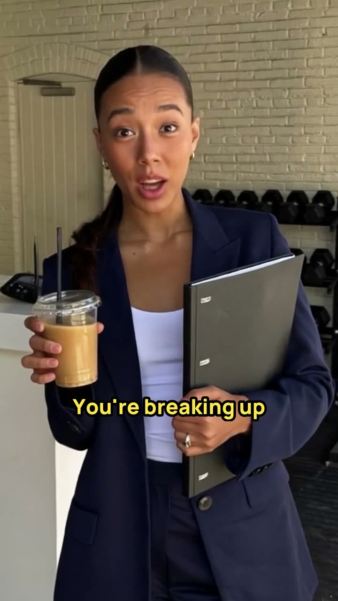

# Example: "It's not you. It's your invoices." on the GPU server

The first YesOpen skit made a second time, on 2 October 2026, from the same script and the same edit, on one
rented H200 with open models instead of Higgsfield. A gym owner breaks up with his marketing agency; every "I don't
know" is answered by a YesOpen notification on his phone. 61.4 s, English. Compare it with the Higgsfield version
in [`../gym-breakup/`](../gym-breakup/); the reference analysis is there too.

What the GPU engine did differently: every line was recorded first (Chatterbox, with voices cloned from the
Higgsfield takes), checked and cut with Whisper, and only then filmed to that sound (LTX-2.3 lip sync), one take
per line. The cast stills are the Higgsfield originals.



## Watch

| File | Format | Size |
| --- | --- | --- |
| [final/web/its-not-you-its-your-invoices-gpu-9x16.mp4](final/web/its-not-you-its-your-invoices-gpu-9x16.mp4) | 9:16, 720x1280 | 13.7 MB |

The 9:16 master (1080x1920, 39.8 MB) is not stored; the commands below rebuild it bit for bit.

## What is here

| Path | Content |
| --- | --- |
| `script.md` | the script document (in Polish, dialogue in English) with the GPU production notes and "Po produkcji" |
| `lines.json` | the script as the GPU engine reads it: characters (voice, still, how the take prompt names them), the take template's tail and seed, 21 lines with acting, what we see, and the exceptions per line |
| `project.json` | engine, cast, takes, speech threshold, caption style, banner texts, end card |
| `voices/` | the two voice samples, 8.6 s and 7.0 s, cut from the Higgsfield takes |
| `stills/` | the two cast stills (the Higgsfield picks), the shaker variant for line 12 made with `still-edit` (`owner-shake.png`), its sheet, `batch-edit.json`, `jobs.jsonl` |
| `voice/` | all 50 voice takes (FLAC): two per line from `batch.json`, four more each for lines 12 and 18 from `batch-l12.json` and `batch-l18.json`, `jobs.jsonl` |
| `lines/` | the 21 fitted lines the takes were filmed to, `l21-pad.wav` (3.3 s of silence, then the line), and `fit.json` with every choice |
| `takes/` | the 21 takes (704x1280, 24 fps), each with its Whisper words and the prompt as sent, `batch.json` and `jobs.jsonl` |
| `edit/cuts.json` | the edit: the Higgsfield cut's shots, punch-ins and events, one take per line |
| `edit/edl.json` | the generated edit decision list |
| `edit/assets/` | the ding and the 9:16 banners, end card and caption sample |
| `edit/frames/` | a frame sheet of every take, the assets sheet, the caption sheet used for QA |
| `edit/qa-summary.json` | the QA numbers |
| `final/web/` | the web copy and its poster |

All paths in the batch files and job logs are relative to the project, so the folder can be moved or re-run.

## How it was made

1. **Voices.** One sample per character, cut from the Higgsfield takes (`voices/`). These are generated voices,
   not a real person's.
2. **Stills.** The Higgsfield picks; Z-Image was not needed. For line 12 one variant with the protein shaker at
   his chin came from `still-edit` with `fast=true` (about 5 s); it kept his face, clothes and the gym.
3. **Voice takes.** `gpu_batches.py voice` wrote 42 jobs, two per line, about 3–5 s each once the voice model
   stayed loaded. The first two takes were enough for 19 lines. Lines 12 and 18 were recorded four more times; line 18
   also with other spellings of "2 a.m.", because the first takes said "two AMA". Chatterbox talked on after most
   lines (line 6 went on for 26 s with invented words); every line was cut after its last word and given 0.3 s of
   silence in front.
4. **Takes.** `gpu_batches.py takes` wrote 21 `talk` jobs: the still, the fitted line, the line's length plus a
   tail of acting (0.5–2.6 s), and a prompt with the framing sentence ("the framing stays the same with no zoom and
   no push-in") and what we see. 13.4 s of GPU time per take on average. Line 16 was filmed a second time: the
   script had him show his phone's screen, so the retake (seed 616) holds the phone with its back to the camera
   and no invented screen appears. Line 21 has 3.3 s of silent joy before "Hey, you.", from `silence_before` and
   its own prompt.
5. **Edit.** The Higgsfield cut, shot for shot: the same punch-ins, dings, banners and end card. A take holds one
   line, so a shot is the whole take with a head of at most 0.28 s.
6. **QA.** Frames exactly as planned (1842), −14.9 LUFS, true peak −1.3 dBTP, Whisper hears the caption text word
   for word.

GPU time for the skit: 10.4 min (voices 5.2 min, most of them before the voice model stayed loaded; takes
4.7 min; still edits 0.6 min). The whole session, with the first install (10 min 40 s) and a test of every
template, took about 1 h and cost $4.86.

## Rebuild it

From the skill folder:

```bash
python3 scripts/make_edl.py examples/gym-breakup-gpu            # cuts.json + transcripts -> edl.json
python3 scripts/assemble.py examples/gym-breakup-gpu --format 9:16
md5 -q examples/gym-breakup-gpu/final/its-not-you-its-your-invoices-gpu-9x16.mp4   # 327f8ffbf16465b95f9651d6aef10d5f
python3 scripts/qa_report.py examples/gym-breakup-gpu --format 9:16 --whisper
```

The batch files can be written again from `lines.json` and give the same jobs: `gpu_batches.py voice`,
`gpu_batches.py takes` (`reseed` wrote the two extra voice batches; their spellings are in the files). With a GPU
server, `gpu.py batch` on each of them makes the takes again; they may differ slightly from these, because GPU
results can change with the card and the driver. The byte-identical check of the render holds with the same ffmpeg
build (8.x on macOS).
